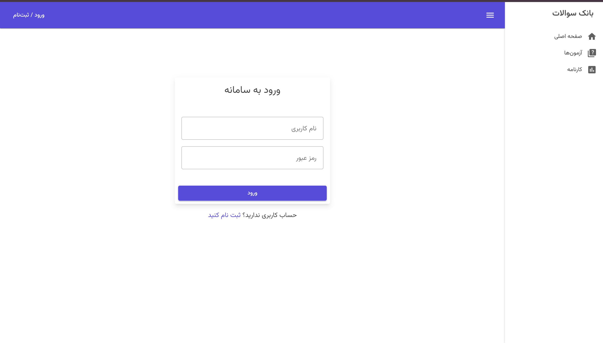
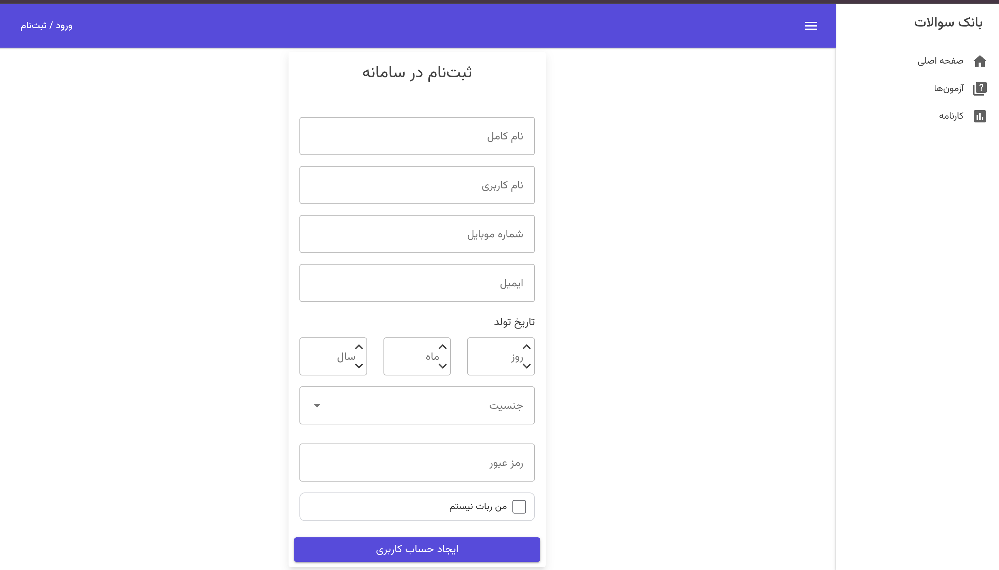
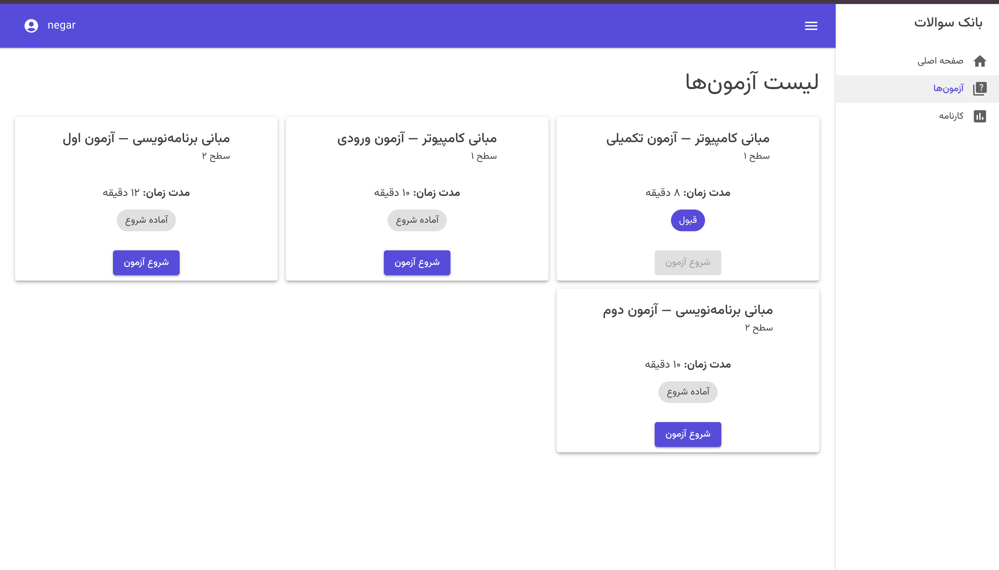
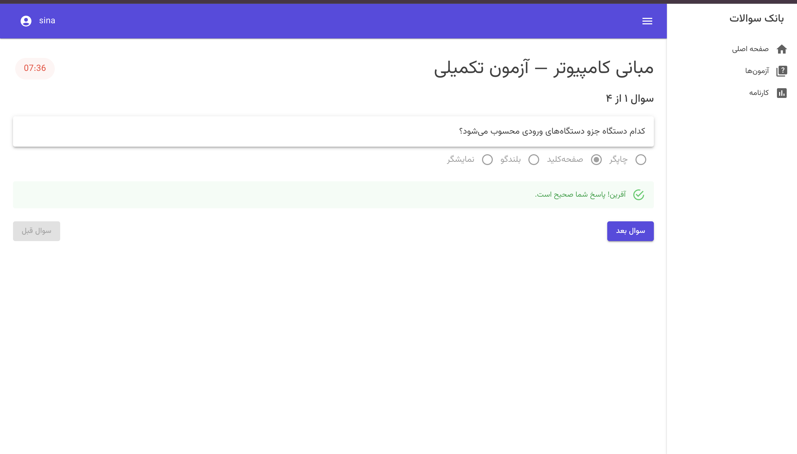
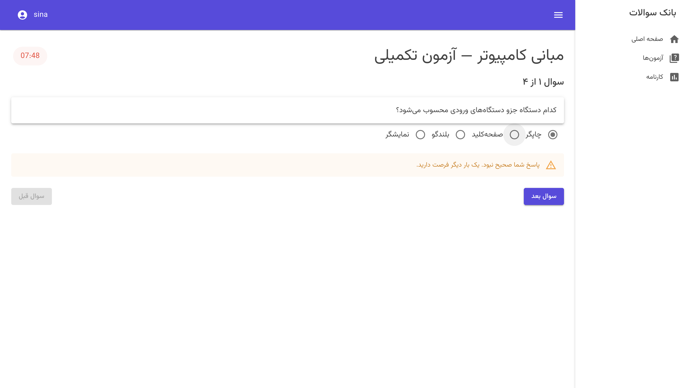
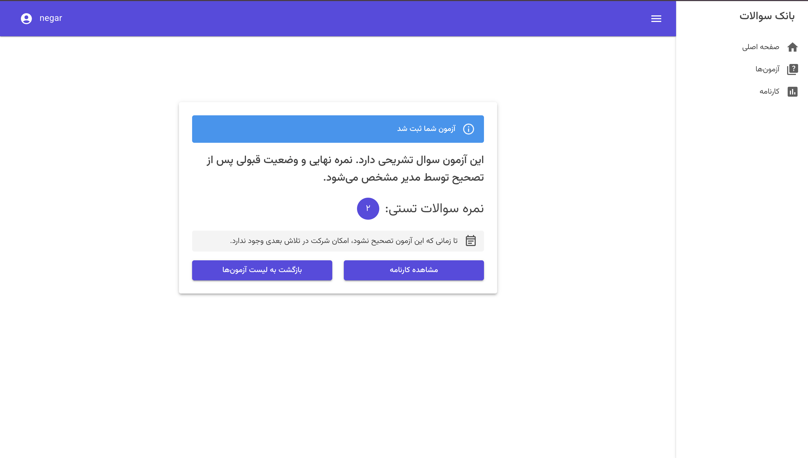
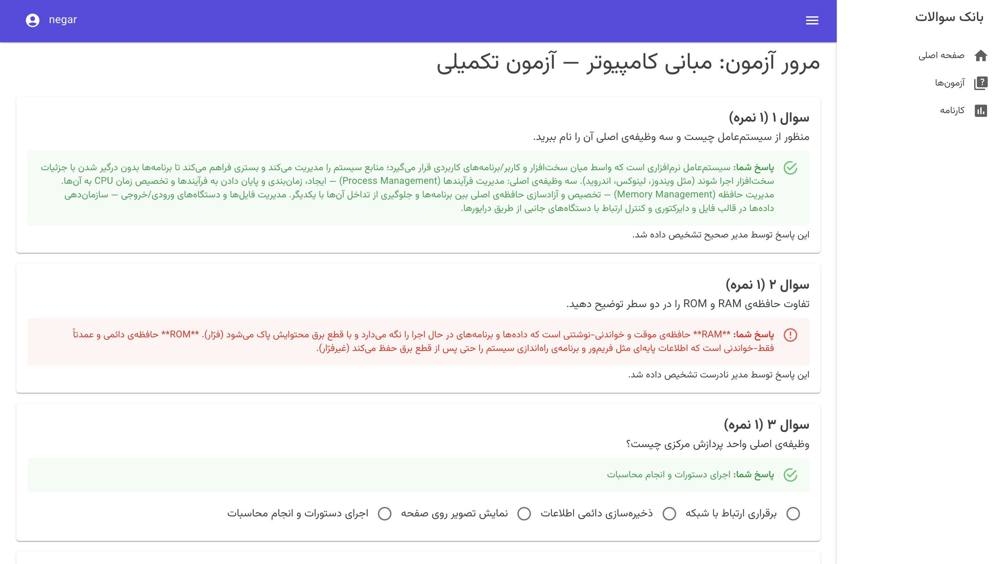
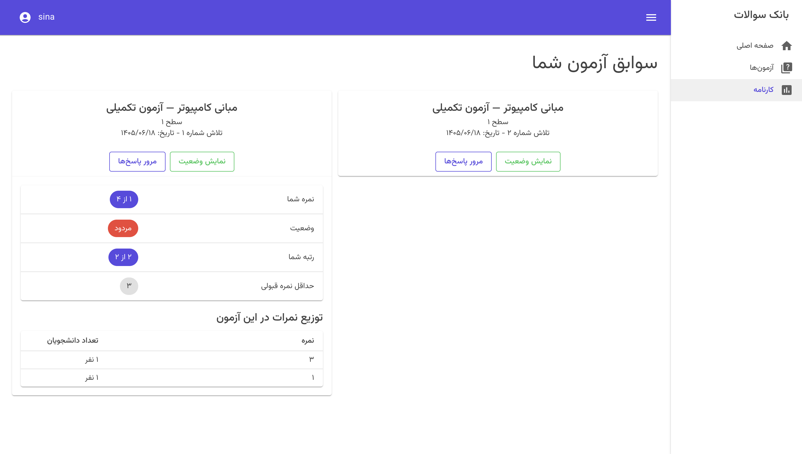
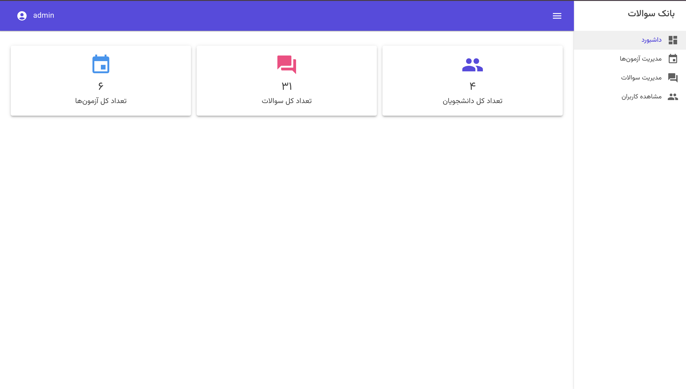
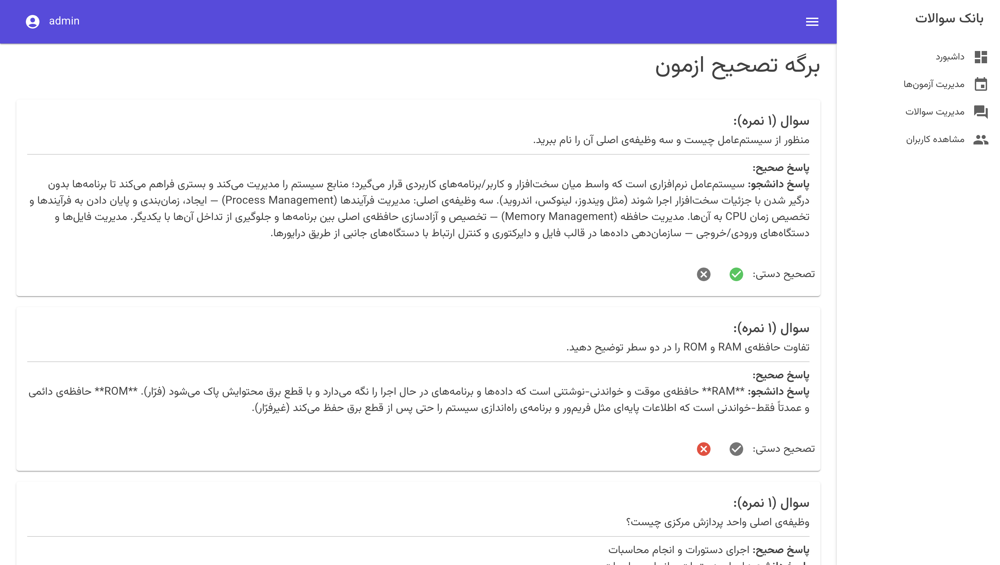

# Question Bank — A Level-Based Online Examination System

A full-stack web application for running tiered online exams. Students progress
through levels by passing exams; each attempt draws a fresh random set of
questions, is timed and graded on the server, and short-answer questions are
routed to an administrator for manual review.

Built with **.NET 9**, **Blazor WebAssembly** and **ASP.NET Core Web API**,
organised along Clean Architecture lines with CQRS.

> Originally built during a software engineering internship, to a specification
> provided by an external client. The interface is in Persian (RTL) because that
> is the language of its intended users.

---

## Screenshots

| Sign in | Register |
|---|---|
|  |  |

**Student's exam list** — exams from the current level *and every level below it*
stay available, each showing its own eligibility state.



**Taking an exam** — answers are graded by the server as they are given. A wrong
answer earns one retry; after the second miss the question locks.

| Correct answer | One retry left |
|---|---|
|  |  |

**Result held for grading** — when an attempt contains short answers, the
provisional multiple-choice score is shown and the final verdict waits for the
administrator.



**Answer review** — per-question breakdown, including the administrator's
verdict on each short answer once graded.



**Results and ranking** — score, pass/fail, rank among peers on the same attempt
number, and the score distribution for that exam.



| Admin dashboard | Grading short answers |
|---|---|
|  |  |

---

## Features

### For students

- Registration and JWT-backed sign in, with Jalali date-of-birth entry
- Exams unlocked by level; passing one promotes the student to the next level,
  while exams from earlier levels remain available
- Each attempt draws a random subset of its level's question pool, so no two
  attempts present the same paper
- Multiple-choice questions are graded live, with one retry before locking
- Short-answer questions are stored for administrator review
- Server-authoritative countdown; refreshing the page resumes the same session
  with the same remaining time and the same locked questions
- Up to three attempts per exam, with a 24-hour wait before the third
- Results page with score, pass/fail, rank and score distribution
- Answer review showing every question, the student's answer, and the correct one

### For administrators

- Dashboard with exam, question and student counts
- Create and edit levels, questions (multiple-choice or short answer, optionally
  with an image) and exams
- Per-exam configuration: duration, passing score and number of questions drawn
- Warning when an exam asks for more questions than its level actually has
- Grade short answers; the attempt is rescored and level promotion applied
- View all registered users and per-exam results

---

## Tech stack

| Layer | Technology |
|---|---|
| Frontend | Blazor WebAssembly (.NET 9), MudBlazor, RTL layout |
| Backend | ASP.NET Core Web API (.NET 9) |
| Patterns | Clean Architecture, CQRS via MediatR, Repository + Unit of Work |
| Data | Entity Framework Core, SQL Server |
| Auth | JWT bearer tokens, role-based authorisation, BCrypt password hashing |
| Infrastructure | Docker (SQL Server), .NET user secrets for local configuration |

---

## Architecture

```
BlazorApp5.sln
├── Domain/        Entities only. No dependencies on any other project.
├── Application/   Use cases as MediatR handlers, contracts, domain services.
├── Api/           Controllers, EF Core DbContext, repositories, JWT, middleware.
├── Client/        Blazor WebAssembly UI.
└── Shared/        DTOs used by both Api and Client.
```

Dependencies point inwards: `Domain` knows nothing about the outside world,
`Application` depends only on `Domain`, and `Api` wires everything together.

Every use case is a MediatR request and handler pair under
`Application/Features/`, which keeps controllers thin — most are a single
`_mediator.Send(...)` call.

---

## Implementation notes

A few decisions worth calling out, since they shaped the design.

### The exam session lives on the server

An earlier version created the attempt record only when the exam was submitted.
That left the server with no memory of an exam in progress, which forced three
compromises: the correct answer had to be sent to the browser so it could grade
answers itself, the retry limit was enforced only in client state, and the
countdown was a client-side timer that a page refresh reset.

The attempt is now created when the exam **starts**. That single change lets the
server own everything that matters:

- `POST /api/student/start-exam/{examId}` validates eligibility, records
  `StartedAt`, stores the drawn questions, and returns them **without** the
  correct answers
- `POST /api/student/check-answer` grades one option server-side and returns
  only correct/incorrect, tracking retries in the database
- `POST /api/student/submit-exam` takes just the attempt id and scores the
  attempt from stored data

Because the session is server-side, refreshing mid-exam resumes it rather than
restarting it.

### One source of truth for the attempt rules

The rules governing whether a student may sit an exam — attempt count, waiting
period, pending grading — live in a single `ExamEligibilityCalculator`. Both the
exam list page and the start-exam endpoint call it, so what a student is shown
can never disagree with what the server will allow.

### Results wait for grading

If an attempt contains an answered short-answer question, `IsPassed` and level
promotion are deferred. The student sees their provisional multiple-choice score
with a note, and cannot start the next attempt until the administrator has
graded it — otherwise they might burn a retry on an exam they had in fact passed.

### All times are UTC

Timestamps are written and compared in UTC throughout, and converted to local
time only for display.

---

## Getting started

### Prerequisites

- [.NET 9 SDK](https://dotnet.microsoft.com/download)
- [Docker](https://www.docker.com/products/docker-desktop/)
- `dotnet-ef` CLI: `dotnet tool install --global dotnet-ef`

### 1. Start SQL Server

```bash
docker compose up -d
```

### 2. Configure secrets

The connection string and JWT signing key are kept out of source control. Set
them once with .NET user secrets:

```bash
cd Api
dotnet user-secrets init
dotnet user-secrets set "ConnectionStrings:DefaultConnection" \
  "Server=localhost;Database=QuestionBlazorDB;User Id=sa;Password=<your-password>;TrustServerCertificate=True;"
dotnet user-secrets set "JwtSettings:Key" "<a long random string>"
```

Generate a suitable key with:

```bash
openssl rand -base64 64
```

The application fails fast at startup with a clear message if either value is
missing.

### 3. Create the database

```bash
dotnet ef database update
```

### 4. Run

```bash
cd ..
dotnet run --project Api
dotnet run --project Client
```

The client reads the API address from `Client/wwwroot/appsettings.json`.

### 5. Create the first administrator

Register through the UI, then promote the account:

```sql
UPDATE Users SET Role = 1 WHERE Username = 'admin';
```

Sign out and back in so the new role is reflected in the token.

---

## Known limitations

Worth stating plainly, since they are design boundaries rather than oversights:

- **Questions belong to levels, not to individual exams.** Every exam at a given
  level draws from the same pool. This matches the original specification, but a
  join table would be needed to give each exam its own question set.
- **The mix of question types is not controlled.** An exam that draws five
  questions from a pool containing both types may give one student five
  multiple-choice questions and another three short answers, so papers are not
  perfectly equivalent.
- **Uploaded images are stored on the local filesystem** under
  `Api/wwwroot/uploads` and are not tracked in version control. A deployment
  would need object storage and a backup strategy.
- **No automated tests yet.** The layered architecture makes the handlers
  straightforward to test in isolation; this is the next thing I would add.

---

## Author

**Bahar Ghalichebaf**
[LinkedIn](https://www.linkedin.com/in/bahar-ghalichebaf)
